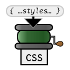

# @ptb/style



### CSS compiler with a powerful, intuitive API that makes authoring CSS faster and easier.

- [Documentation][docs]
- [View Demo][demo]
- [Report Bugs][bugs]
- [Request Feature][talk]

### Stop Naming Things

- The point of CSS is not about naming things; it’s about style and design.
- Skip naming and remembering class names and let the computer do it for you.
- And it’s your choice if you’d like atomic class names or grouped class names.
- Names are generated automatically and consistently based on styles input.

### Production Ready

- Zero-runtime overhead or dynamic runtime or a mix of both, automatically.
- Universal tool for rendering at build-time, server-side, or on the client.

## Installation

Add `@ptb/style` to your project:

- npm
  ```sh
  npm install @ptb/style
  ```

- yarn
  ```sh
  yarn add @ptb/style
  ```

## Usage

Import the `css` function and use with the `className` prop:

```jsx
import { css } from "@ptb/style"

export default function ({ children }) {
  return (
    <div className={css({ })}>
      {children}
    </div>
  )
}
```

## License

Distributed under the Apache License. See [`LICENSE`](LICENSE) for more information.

## Acknowledgments

- Thanks to [Austin Appleby](https://github.com/aappleby) for [MurmurHash3](https://github.com/aappleby/smhasher).
- Thanks to [Gary Court](https://github.com/garycourt) for [murmurhash-js](https://github.com/garycourt/murmurhash-js).
- Thanks to [Andrey Sitnik](https://github.com/ai) for [nanoid](https://github.com/ai/nanoid/blob/main/non-secure/index.js).

[docs]: https://ptb.dev/style/
[bugs]: https://github.com/ptb/style/issues
[talk]: https://github.com/ptb/style/discussions

[demo]: https://ptb.dev/style/demo/?x=createElement%28%0A++%22span%22%2C%0A++%7B%0A++++className%3A+css%28%7B%0A++++++bg%3A+%22%239c9%22%2C%0A++++++p%3A+%224px+10px%22%2C%0A++++++display%3A+%22block%22%2C%0A++++++maxWidth%3A+200%2C%0A++++++m%3A+%22auto%22%2C%0A++++++textAlign%3A+%22center%22%2C%0A++++++borderRadius%3A+10%2C%0A++++++border%3A+%222px+solid+%23696%22%2C%0A++++++fontWeight%3A+700%2C%0A++++++fontFamily%3A+%22sans-serif%22%2C%0A++++++fontSize%3A+24%2C%0A++++++animationName%3A+%7B%0A++++++++%220%25%22%3A+%7B%0A++++++++++transform%3A+%22scale3d%281%2C1%2C1%29%22%0A++++++++%7D%2C%0A++++++++%2210%25%2C20%25%22%3A+%7B%0A++++++++++transform%3A%0A++++++++++++%22scale3d%28.9%2C.9%2C.9%29+rotate3d%280%2C0%2C1%2C-3deg%29%22%0A++++++++%7D%2C%0A++++++++%2230%25%2C50%25%2C70%25%2C90%25%22%3A+%7B%0A++++++++++transform%3A%0A++++++++++++%22scale3d%281.1%2C1.1%2C1.1%29+rotate3d%280%2C0%2C1%2C3deg%29%22%0A++++++++%7D%2C%0A++++++++%2240%25%2C60%25%2C80%25%22%3A+%7B%0A++++++++++transform%3A%0A++++++++++++%22scale3d%281.1%2C1.1%2C1.1%29+rotate3d%280%2C0%2C1%2C-3deg%29%22%0A++++++++%7D%2C%0A++++++++to%3A+%7B%0A++++++++++transform%3A+%22scale3d%281%2C1%2C1%29%22%0A++++++++%7D%0A++++++%7D%2C%0A++++++animationDuration%3A+%221s%22%2C%0A++++++animationIterationCount%3A+%22infinite%22%2C%0A++++%7D%29%0A++%7D%2C%0A++%22Buy+Now%21%22%0A%29#t=0
